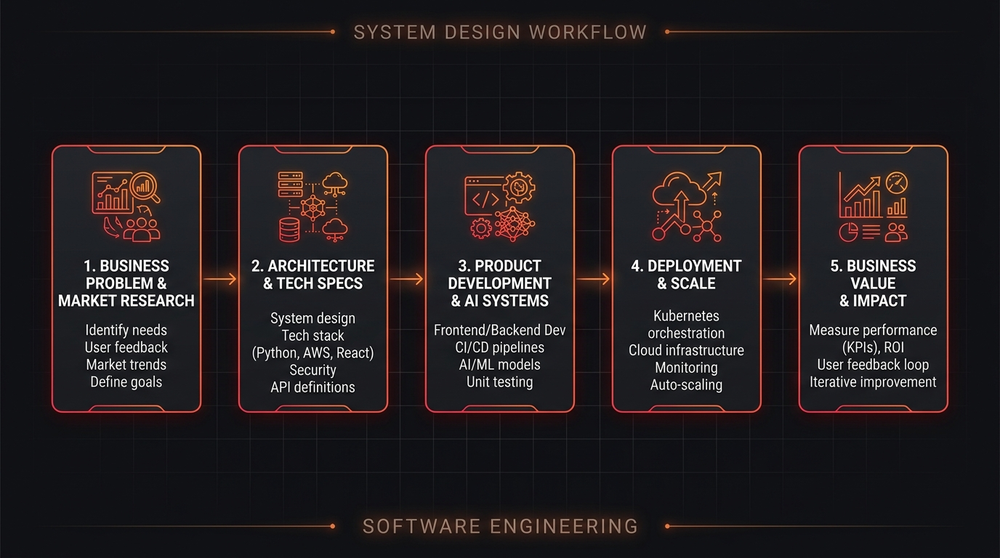
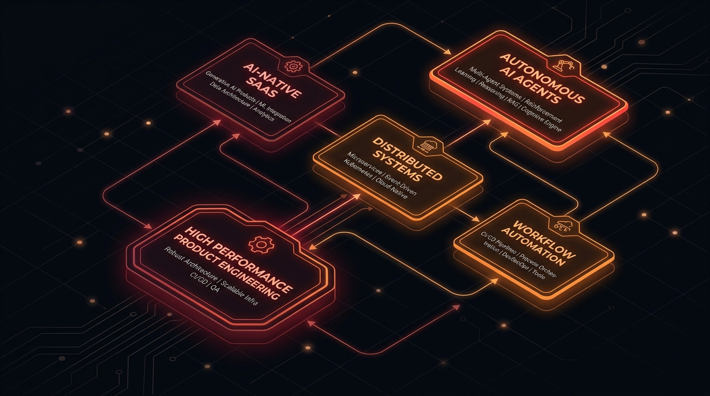

<!-- ========================================================= -->
<!--                     HERO SECTION                          -->
<!-- ========================================================= -->

# Shreysh Nair

### Software Developer · Product Engineer · Business Solutions Architect

**Building software that solves real problems — from business strategy to system architecture to production.**

 

  

---

# About Me

Computer Engineering student and software/product builder working at the intersection of **Technology × Product × Business Strategy**.

Specializing in breaking down ambiguous business problems into clean requirements, designing scalable system architectures, and engineering high-impact production software.

* **Core Focus:** Full-stack development, AI/ML systems, FinTech, Healthcare Tech, Web3, and startup operations.
* **Philosophy:** Bridging the gap between code quality and business viability — ensuring every system built solves a real problem, creates measurable value, and scales efficiently.

---

# How I Think & Build

 

**Understand → Architect → Build → Deploy → Measure → Iterate**

---

# Tech Stack & Capabilities

### Frontend & UI/UX

  

### Backend & Systems

  

### AI / ML & Data

  

### Cloud, Databases & DevOps

  

<table>
  <tr>
    <td width="50%">
      <b>Product & Strategy</b> 
      • Product Roadmapping & Discovery 
      • UX Architecture & Usability Engineering 
      • Design Systems & Figma Tokens 
      • GTM Strategy & Value Proposition
    </td>
    <td width="50%">
      <b>Industry Domains</b> 
      • Autonomous AI Agents & AI-Native SaaS 
      • FinTech & WealthTech 
      • HealthTech & Bioinformatics 
      • Web3 & Decision Support Systems
    </td>
  </tr>
</table>

---

# Selected Projects

<table>
  <tr>
    <td width="50%" valign="top">
      <h3>Scout.ai</h3>
      
<b>AI-Powered Startup Intelligence & Deal-Flow Command Center</b>

      
Automates startup discovery and analysis into an AI-assisted intelligence workflow with automated website analysis and growth signals extraction.

      

        <code>Next.js</code> · <code>AI Integrations</code> · <code>Framer Motion</code> · <code>Automation</code>
      

    </td>
    <td width="50%" valign="top">
      <h3>Zenthera</h3>
      
<b>ML × Healthcare × Antimicrobial Resistance (AMR)</b>

      
Bioinformatics predictive platform analyzing biological sequence (FASTA) and bacterial resistance patterns for intelligent clinical insights.

      

        <code>Machine Learning</code> · <code>Bioinformatics</code> · <code>Healthcare AI</code> · <code>Python</code>
      

    </td>
  </tr>
  <tr>
    <td width="50%" valign="top">
      <h3>SpendWise</h3>
      
<b>AI Personal Finance & Wealth Analytics</b>

      
Converts raw financial transactions into automated categorization, intelligent budget tracking, and real-time spending insights.

      

        <code>Next.js</code> · <code>Financial Analytics</code> · <code>AI Engine</code> · <code>Full Stack</code>
      

    </td>
    <td width="50%" valign="top">
      <h3>SilverSentinel</h3>
      
<b>AI Agents × FinTech × Web3 Trading</b>

      
Autonomous AI-agent execution layer and dark glassmorphic dashboard built for silver commodity and derivatives market intelligence.

      

        <code>React</code> · <code>Framer Motion</code> · <code>Autonomous Agents</code> · <code>FinTech</code>
      

    </td>
  </tr>
</table>

---

# GitHub Activity & Telemetry

  

---

# Experience & Leadership

<table>
  <thead>
    <tr>
      <th align="left">Role</th>
      <th align="left">Organization</th>
      <th align="left">Period</th>
      <th align="left">Focus Areas</th>
    </tr>
  </thead>
  <tbody>
    <tr>
      <td><b>Founder’s Office Intern</b></td>
      <td>Saventh</td>
      <td><code>2026 – Present</code></td>
      <td>Strategy, product positioning, embedded finance, competitor analysis, GTM planning, and product redesign.</td>
    </tr>
    <tr>
      <td><b>Management Lead</b></td>
      <td>TEDxCRCE</td>
      <td><code>2026 – Present</code></td>
      <td>Operational planning, stakeholder coordination, Internship Expo, and flagship event execution.</td>
    </tr>
    <tr>
      <td><b>Junior Events Coordinator</b></td>
      <td>GDSC CRCE</td>
      <td><code>2025 – 2026</code></td>
      <td>BIT N BUILD Hackathon, Future Forge, Idea Café, outreach logistics, and technical event management.</td>
    </tr>
    <tr>
      <td><b>UI Design Intern</b></td>
      <td>Tree Transparency</td>
      <td><code>2024</code></td>
      <td>User-centric UI/UX design, environmental tracking interface, and design requirement translation.</td>
    </tr>
  </tbody>
</table>

---

# Current Focus Areas

---

# Connect

&nbsp;&nbsp;

&nbsp;&nbsp;

  

**Build things that matter.**

